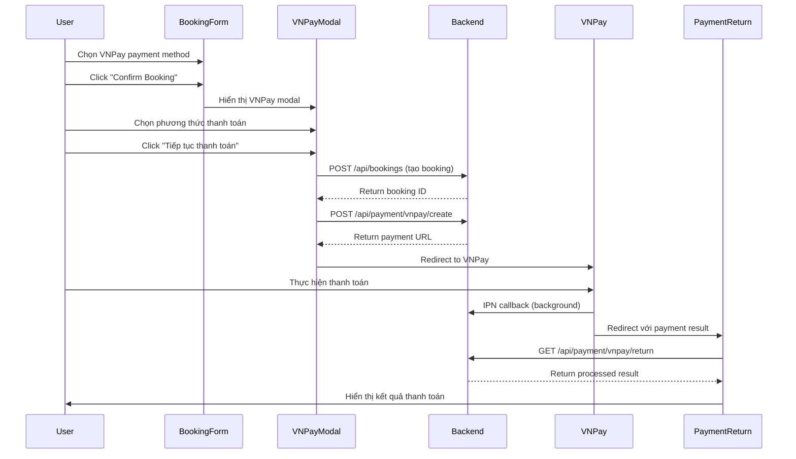

# VNPay Integration Setup - Frontend

## Tổng quan
VNPay đã được tích hợp hoàn chỉnh vào booking form của frontend. Người dùng có thể chọn thanh toán qua VNPay hoặc thanh toán tiền mặt khi check-in.

## Flow thanh toán VNPay

### 1. Booking Form Integration
- **File**: `src/components/EnhancedBookingForm.tsx`
- **Tính năng**:
  - Hiển thị 2 phương thức thanh toán: VNPay và Cash on Check-in
  - Modal chọn ngân hàng khi thanh toán VNPay
  - Xử lý redirect đến VNPay payment gateway

### 2. Payment Modal
- **File**: `src/components/VNPayPaymentModal.tsx`
- **Tính năng**:
  - Hiển thị các phương thức thanh toán VNPay (QR Code, ATM, Visa/Master...)
  - Thông tin test cards cho sandbox
  - UI responsive và user-friendly

### 3. Payment Return Page
- **File**: `src/pages/PaymentReturnPage.tsx`
- **Route**: `/payment/return`
- **Tính năng**:
  - Xử lý callback từ VNPay
  - Hiển thị kết quả thanh toán (thành công/thất bại)
  - Navigation đến booking history hoặc trang chủ

## Luồng thanh toán chi tiết



## Các file quan trọng

### Types và API
```typescript
// src/types/vnpay.ts
- VNPayPaymentRequest
- VNPayPaymentResponse  
- VNPayReturnParams
- VNPAY_BANK_OPTIONS
- VNPAY_RESPONSE_CODES

// src/services/api.ts
- vnpayAPI.createPayment()
- vnpayAPI.processReturn()
- vnpayAPI.verifySignature()
```

### Components
```typescript
// src/components/EnhancedBookingForm.tsx
- Tích hợp VNPay payment option
- handleVNPayPayment() method
- VNPay modal integration

// src/components/VNPayPaymentModal.tsx  
- Modal chọn phương thức thanh toán
- Bank options selection
- Test environment notice

// src/pages/PaymentReturnPage.tsx
- Xử lý VNPay return URL
- Hiển thị payment result
- Navigation actions
```

### Routing
```typescript
// src/App.tsx
Route: /payment/return -> PaymentReturnPage
```

## Cấu hình môi trường

### Environment Variables (cho Backend)
```bash
# VNPay Sandbox Configuration
VNPAY_TMN_CODE=your_tmn_code
VNPAY_SECRET_KEY=your_secret_key
VNPAY_API_URL=https://sandbox.vnpayment.vn/paymentv2/vpcpay.html
VNPAY_RETURN_URL=http://localhost:3000/payment/return
VNPAY_IPN_URL=http://localhost:8080/api/payment/vnpay/ipn
```

### Frontend Configuration
```typescript
// Frontend tự động detect environment từ API_URL
const API_URL = 'http://localhost:8080'; // Dev
// const API_URL = 'https://api.yourdomain.com'; // Production
```

## Test Data

### Test Cards (Sandbox)
```
Số thẻ: 9704198526191432198
Tên chủ thẻ: NGUYEN VAN A
Ngày hết hạn: 07/15
CVV: 123
OTP: 123456
```

### Test Bank Codes
- `VNBANK`: Chuyển khoản ngân hàng
- `VNPAYQR`: Thanh toán QR Code  
- `INTCARD`: Thẻ quốc tế
- `VISA`: Thẻ Visa
- `MASTERCARD`: Thẻ Mastercard

## Features đã implement

### ✅ Hoàn thành
- [x] VNPay payment method trong booking form
- [x] Modal chọn phương thức thanh toán
- [x] Integration với backend VNPay APIs
- [x] Payment return page với result display
- [x] Error handling và validation
- [x] Test environment configuration
- [x] Responsive UI design
- [x] TypeScript types đầy đủ

### 🚀 Có thể mở rộng
- [ ] Payment status tracking real-time
- [ ] Payment history và receipts
- [ ] Email notification templates
- [ ] Mobile app integration
- [ ] Multiple payment gateways
- [ ] Payment analytics dashboard

## Cách sử dụng

### 1. Người dùng thực hiện booking
1. Vào booking form, điền thông tin
2. Chọn payment method = "VNPay"
3. Click "Confirm Booking"
4. Chọn phương thức thanh toán trong modal
5. Redirect đến VNPay để thanh toán
6. Sau khi thanh toán, redirect về `/payment/return`
7. Xem kết quả và navigate đến booking history

### 2. Development testing
```bash
# Start backend
cd booking-be
./mvnw spring-boot:run

# Start frontend  
cd booking
npm run dev

# Test URL
http://localhost:3000/booking?hotelId=xxx&roomTypeId=xxx&checkIn=xxx&checkOut=xxx
```

## Troubleshooting

### Lỗi thường gặp

**1. CORS Error**
```
Solution: Đảm bảo backend cho phép frontend origin
```

**2. Invalid Signature**
```
Solution: Kiểm tra VNPAY_SECRET_KEY trong backend
```

**3. Payment URL not generated**
```
Solution: Kiểm tra VNPay configuration và network
```

**4. Return URL không hoạt động**
```
Solution: Đảm bảo route /payment/return được config đúng
```

### Debug Tips
```typescript
// Enable VNPay debug logs
console.log('VNPay Request:', vnpayRequest);
console.log('Payment URL:', paymentUrl);
console.log('Return Params:', returnParams);
```

## Security Notes

### Production Checklist
- [ ] Đổi từ sandbox sang production URLs
- [ ] Cập nhật TMN_CODE và SECRET_KEY production
- [ ] Implement IP whitelisting cho IPN
- [ ] Enable HTTPS cho tất cả endpoints
- [ ] Validate và sanitize tất cả VNPay parameters
- [ ] Implement rate limiting cho payment APIs
- [ ] Log và monitor payment transactions

### Best Practices
- Luôn verify signature từ VNPay
- Không trust client-side payment data
- Implement idempotency cho payment processing
- Store payment logs cho audit
- Handle timeout và retry logic
- Implement proper error boundaries 